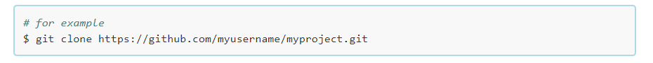
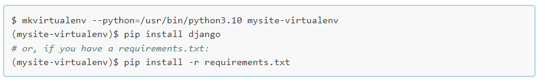

# The Task ME - API
The TaskME is a Task platform for the modern world. The project manager can create Projects on this platform and assign them to different user.You can view all the tasks and projects and see who dey are assigned to from the Project managers End. In this app you can also see deadlines of the Current Projects ,thier start date of the projects and it end date.Each User is restricted to see the Tasks assigned to them and get more details about each project.This section of the project is the backend API database built to support the ReactJS frontend, and it is powered by the Django Rest Framework.

#### DEPLOYED BACKEND API RENDER [LINK](https://taskit-Diddy.pythonanywhere.com)
#### DEPLOYED FRONTEND RENDER [LIVE SITE](https://taskme-9502ad.netlify.app)
#### DEPLOYED FRONTEND [REPOSITORY](https://github.com/diddyjax19/Taskit-FrontEnd)

## Table of Contents
+ [User Stories](#user-stories "User Stories")
+ [Database](#database "Database")
+ [Testing](#testing "Testing")
  + [Validator Testing](#validator-testing "Validator Testing")
  + [Unfixed Bugs](#unfixed-bugs "Unfixed Bugs")
+ [Technologies Used](#technologies-used "Technologies Used")
  + [Main Languages Used](#main-languages-used "Main Languages Used")
  + [Frameworks, Libraries & Programs Used](#frameworks-libraries-programs-used "Frameworks, Libraries & Programs Used")
+ [Deployment](#deployment "Deployment")
+ [Credits](#credits "Credits")
  + [Content](#content "Content")
  + [Media](#media "Media")

## User Stories:
All User Stories have been documented in their own file, the link for which can be found [HERE](static/userstories.md).

I have included links to the [GitHub Issues](https://github.com/diddyjax19/Project5-taskmeBackEnd/issues) for this project, as well as the [KANBAN board](https://github.com/users/diddyjax19/projects/5).

## Database:


## Testing:
### Validator Testing: 
All files passed through [PEP8](http://pep8online.com/) without error.


### Manual Testing:
1. Manually verified each url path created works & opens without error.
2. Verified that the CRUD functionality is available in each app via the development version: Create Project, Create Task, Create USers, Assign Tasks, Assign Date and time.
 - Checked this by going to each link.
 - Creating a new user.
 - User Login
 - Creating Project with all details.
 - Creating Tasks with all details.
 - Assiging Tasks to the appropraite User.
 - Creating Project Date and time
 - Creating Project Status.
2. - Made sure that each user are not able to see the projects thhatthey are not assigned or are not working on .
    `- Ran migrations file.
 - deleted `0001_initial.py` files & `__pycache__` from the migration folders in all apps.
 - Ran the migration commands again:
```
python3 manage.py makemigrations
python3 manage.py migrate
```
3. - created a new super user to test functionality
```
python3 manage.py createsuperuser
```
 - upon returning to the development version of the app, we were now unable to login or create a new user
 - clearing the browser cookies & cache, as well as relaunching the gitpod workspace resolved this.

### Manual Deplyoment In Python Anywhere:

1. - Uploading your code to PythonAnywhere
    Assuming your code is already on a code sharing site like GitHub or Bitbucket, you can just clone it from a Bash Console:



2. Create a virtualenv and install Django and any other requirements
    In your Bash console, create a virtualenv, naming it after your project, and choosing the version of Python you want to use:


  Warning: Django may take a long time to install. PythonAnywhere has very fast internet, but the filesystem access can be slow, 
  and Django creates a lot of small files during its installation. Thankfully you only have to do it once!

TIP: if you see an error saying mkvirtualenv: command not found, check out InstallingVirtualenvWrapper.

3. Setting up your Web app and WSGI file
    At this point, you need to be armed with 3 pieces of information:

  The path to your Django project's top folder -- the folder that contains "manage.py", eg /home/myusername/mysite
  The name of your project (that's the name of the folder that contains your settings.py), eg mysite
  The name of your virtualenv, eg mysite-virtualenv
  Create a Web app with Manual Config
  Head over to the Web tab and create a new web app, choosing the "Manual Configuration" option and the right version of Python (the same one you used to create your virtualenv).


4. NOTE: Make sure you choose Manual Configuration, not the "Django" option, that's for new projects only.
    Enter your virtualenv name
    Once that's done, enter the name of your virtualenv in the Virtualenv section on the web tab and click OK.


5. You can just use its short name "mysite-virtualenv", and it will automatically complete to its full path in /home/username/.virtualenvs.

    Optional: enter path to your code
    Although this isn't necessary for the app to work, you can optionally set your working directory and give yourself a convenient hyperlink to your source files from the web tab.

    Enter the path to your project folder in the Code section on the web tab, eg /home/myusername/mysite in Source code and Working directory


6. Edit your WSGI file
    One thing that's important here: your Django project (if you're using a recent version of Django) will have a file inside it called wsgi.py. This is not the one you need to change to set things up on PythonAnywhere -- the system here ignores that file.

    Instead, the WSGI file to change is the one that has a link inside the "Code" section of the Web tab -- it will have a name something like /var/www/yourusername_pythonanywhere_com_wsgi.py or /var/www/www_yourdomain_com_wsgi.py.

    Click on the WSGI file link, and it will take you to an editor where you can change it.

    Delete everything except the Django section and then uncomment that section. Your WSGI file should look something like this:


7. Be sure to substitute the correct path to your project, the folder that contains manage.py, which you noted above.
    Don't forget to substitute in your own username too!
    * Also make sure you put the correct value for DJANGO_SETTINGS_MODULE.
    * This guide assumes you're using a recent version of Django, so leave the old wsgi.WSGIHandler() code commented out, or better still, delete it.
  
8. Save the file, then go and hit the Reload button for your domain. (You'll find one at the top right of the wsgi file editor, or you can go back to the main web tab).

9. Database setup
    If, like most sites, your site uses a database, you'll need to set that up. Go to the Consoles tab, start a bash console, use cd to navigate to the directory where your Django project's manage.py lives, then run.


## Deployment:
### Project creation:
1. Create the GitHub repository.
2. Create the project app on [PythonAnywhere](pythonanywhere.com).

It is important to keep sensitive bits of code like API keys and passwords away from the public.

1. Install Django Environ
In your terminal, inside the project directory, type:

`$ pip install django-environ`

2. Import environ in settings.py
`import environ`

3. Initialise environ
Below your import in settings.py:
### Initialise environment variables
env = environ.Env()
environ.Env.read_env()

4. Create your .env file
In the same directory as settings.py, create a file called `.env`

5. Declare your environment variables in .env
Make sure you don’t use quotations around strings.

SECRET_KEY=h^z13$qr_s_wd65@gnj7a=xs7t05$w7q8!x_8zsld#
DATABASE_NAME=mysql
DATABASE_USER=bob
DATABASE_PASS=supersecretpassword

6. IMPORTANT: Add your .env file to .gitignore
If you don’t have a .gitignore file already, create one at the project root.

Make sure the name of your .env file is included.

7. Replace all references to your environment variables in settings.py

```
DATABASES = {
‘default’: {
‘ENGINE’: ‘django.db.backends.postgresql_psycopg2’,
‘NAME’: env(‘DATABASE_NAME’),
‘USER’: env(‘DATABASE_USER’),
‘PASSWORD’: env(‘DATABASE_PASS’),
}
}
```
And

`SECRET_KEY = env(‘SECRET_KEY’)`

# Using MySQL 
To start using MySQL, you'll need to go to the MySQL tab on your dashboard, and set up a password. You'll also find the connection settings (host name, username) on that tab, as well as the ability to create new databases.

You can start a new MySQL console to access your databases from this tab too, or alternatively you can open a MySQL shell with the following command from a bash console or ssh session:

`mysql -u USERNAME -h HOSTNAME -p 'USERNAME$DATABASENAME'`
In this:

The USERNAME is the username you use to log in to PythonAnywhere
The HOSTNAME is on your Databases tab
The 'USERNAME$DATABASENAME' is the full name of your database, which comprises your username, then a dollar sign, then the name you gave it. The single quotes around it are important! If you don't put them in there, bash will try to interpret the $DATABASENAME as an environment variable, which will lead to an error saying ERROR 1044 (42000): Access denied for user 'USERNAME'@'%' to database 'USERNAME'
When you run the command, it will prompt you for a password -- use the one you entered on the Databases tab.

Accessing MySQL from Python

The appropriate libraries are installed for all versions of Python that are supported, so if you're not using a virtualenv, to access a MySQL database just import MySQLdb.

If you are using a virtualenv, you'll need to install the correct package yourself. Start a bash console inside the virtualenv, then:

For Python 3.x

`pip install mysqlclient`

### MySQL with Django
To configure Django to access a MySQL database on PythonAnywhere, you need to do this in your settings file:

```
DATABASES = {
    'default': {
        'ENGINE': 'django.db.backends.mysql',
        'NAME': '<your_username>$<your_database_name>',
        'USER': '<your_username>',
        'PASSWORD': '<your_mysql_password>',
        'HOST': '<your_mysql_hostname>',
    }
}

```
Again, you can get the username and hostname details from the "Databases" tab.

### MySQL with Django tests
When you run Django tests that use the database, Django tries to create a database called `test_<original database name>` and that will fail because Django does not have permissions to create a new database. To run Django tests on PythonAnywhere, add a TEST key to your database definition in settings.py. Like this:

```
DATABASES = {
    'default': {
         ...
        'TEST': {
          'NAME': '<your username>$test_<your database name>',

```
[More info here:](https://docs.djangoproject.com/en/3.2/ref/settings/#test)

We suggest you use a form like `<your username>$test_<your database name>`. Create this database from the PythonAnywhere Databases tab and Django will happily use it and run your tests.

## *Accessing your MySQL database from outside PythonAnywhere
There are a number of ways to do this. The first thing you need to know is the SSH hostname for your account:

If your account is on our global, US-based system at www.pythonanywhere.com, then the SSH hostname is ssh.pythonanywhere.com
If your account is on our EU-based system at eu.pythonanywhere.com, then the SSH hostname is ssh.eu.pythonanywhere.com
Note the difference in hostnames for both SSH and MySQL:

Hostname	SSH	MySQL
Global-US	ssh.pythonanywhere.com	username.mysql.pythonanywhere-services.com
EU	ssh.eu.pythonanywhere.com	username.mysql.eu.pythonanywhere-services.com

### From Python code
If you're running Python code on your local machine, and you want it to access your MySQL database, you can install the sshtunnel package (`pip install sshtunnel`)and then use code like this:

```
import MySQLdb
import sshtunnel

sshtunnel.SSH_TIMEOUT = 5.0
sshtunnel.TUNNEL_TIMEOUT = 5.0

with sshtunnel.SSHTunnelForwarder(
    ('your SSH hostname'),
    ssh_username='your PythonAnywhere username', ssh_password='the password you use to log in to the PythonAnywhere website',
    remote_bind_address=('your PythonAnywhere database hostname, eg. yourusername.mysql.pythonanywhere-services.com', 3306)
) as tunnel:
    connection = MySQLdb.connect(
        user='your PythonAnywhere database username',
        passwd='your PythonAnywhere database password',
        host='127.0.0.1', port=tunnel.local_bind_port,
        db='your database name, eg yourusername$mydatabase',
    )
    # Do stuff
    connection.close()

```
This example uses the mysqlclient library, which you can install on your machine with

`pip install mysqlclient`
...but you can use any MySQL library you like.


## Technologies Used:
### Main Languages Used:
- Python

### Frameworks, Libraries & Programs Used:
- Django
- Asgiref
- Django-cors-headers
- Pytz
- Sqlparse
- Django RestFramework
- Pillow
- Django Rest Auth
- PostgreSQL
- Cors Headers
- DrawSQL: An interactive ERD platform that allows you to set up your database tables, & build the connections between them for a visual layout.


## CREDITS:

### Content:
- The creation of this API database was provided through the step by step guide of the C.I. DRF-API walkthrough project.
- All classes & functions have been credited.
- Modifications have been made to the 'Profiles' & 'Posts' app models, and an additional two apps along with models, serializers & views have been created by me.
- Oisin from Tutor support went above & beyond to assist me in resolving an issue with my database that prevented new posts from being created. The steps we took have been documented in point #5 of the Manual Testing section.

### Media:
- Default post image Photo by Artem Podrez from [Pexels](https://www.pexels.com/photo/image-of-a-whale-made-of-scrap-materials-7048043/)
- Default profile image from [Favicon](https://favicon.io/emoji-favicons/alien-monster)
